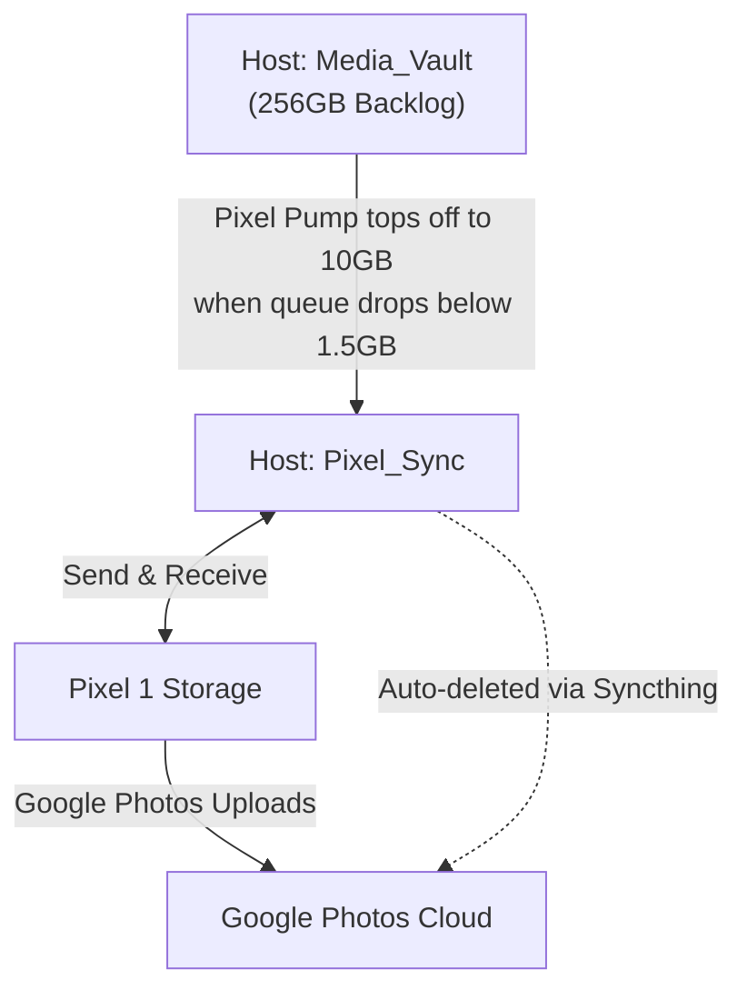

# Pixel Pump

An automated, Dockerized media feeder designed to squeeze massive media archives through the 32GB bottleneck of an original Google Pixel 1 for unlimited Google Photos backups.

## The Problem

You have hundreds of gigabytes of media (like 256GB of split 4K video) that you want to back up through a first-generation Google Pixel to utilize its lifetime unlimited Google Photos perk. If you dump all that data into Syncthing at once, the Pixel's 32GB drive instantly fills up, the Android OS chokes, and the upload pipeline freezes.

## The Solution

**Pixel Pump** acts as an automated valve. It drip-feeds your media into a Syncthing folder in safe, digestible batches (e.g., 10GB).

To ensure the Pixel never sits idle waiting for transfers, Pixel Pump uses a "Low Water" threshold. Once the Pixel uploads files and Syncthing clears local space causing the folder to drop below a certain size (e.g., 1.5GB), Pixel Pump instantly tops the folder back up to 10GB. The snake eats its own tail until your massive backlog is completely backed up.

## Prerequisites

- [Syncthing:](https://syncthing.net/) Must be installed and configured on both your host machine and your Google Pixel.
- [Docker & Docker Compose:](https://www.docker.com/) To run the Pixel Pump container on your server.
- **Automation App (Optional but Recommended):** An app like [MacroDroid](https://play.google.com/store/apps/details?id=com.arlosoft.macrodroid&hl=en) or [Tasker](https://play.google.com/store/apps/details?id=net.dinglisch.android.taskerm&hl=en) on your Pixel to automatically trigger the "Free up space" action in Google Photos.

## The Architecture



## Quick Start (Docker Compose)

1. Create your directories on your host machine:
   Maintain two separate directories. Do NOT point Syncthing at your vault.

- Media_Vault: Where your massive backlog lives.
- Pixel_Sync: An empty folder shared with your Pixel via Syncthing.

2. Configure Syncthing & Pixel:

- Set the Pixel_Sync folder to Send & Receive on both the server and the Pixel.
- Set up an automation on your Pixel (via MacroDroid or Tasker) to periodically click the "Free up space" button in Google Photos.

3. Deploy the Container:
   Create a docker-compose.yml file:

```yaml
version: "3.8"

services:
  pixel-pump:
  build: .
  container_name: pixel-pump
  restart: unless-stopped
  environment:
    - BATCH_GB=10
    - MIN_THRESHOLD_GB=1.5
    - CHECK_INTERVAL=120
  volumes:
    - /path/to/your/Media_Vault:/vault
    - /path/to/your/Pixel_Sync:/sync
```

Run the container in the background:

```sh
docker-compose up -d --build
```

## Environment Variables

| Variable         | Description                                                                               | Default |
| :--------------- | :---------------------------------------------------------------------------------------- | :------ |
| BATCH_GB         | The target size of the sync folder queue in GB.                                           | 10      |
| MIN_THRESHOLD_GB | The low-water mark in GB. When the folder drops below this, it refills. Decimals allowed. | 1.5     |
| CHECK_INTERVAL   | How often (in seconds) the script checks the folder size.                                 | 120     |

## Important Notes

Because this setup relies on a Send & Receive Syncthing configuration to auto-clear the host folder, the original files are permanently deleted from the Pixel_Sync folder once Google Photos processes them. Do not use this pipeline if you want to keep local copies of the media—this is strictly a one-way archival funnel to the cloud!
